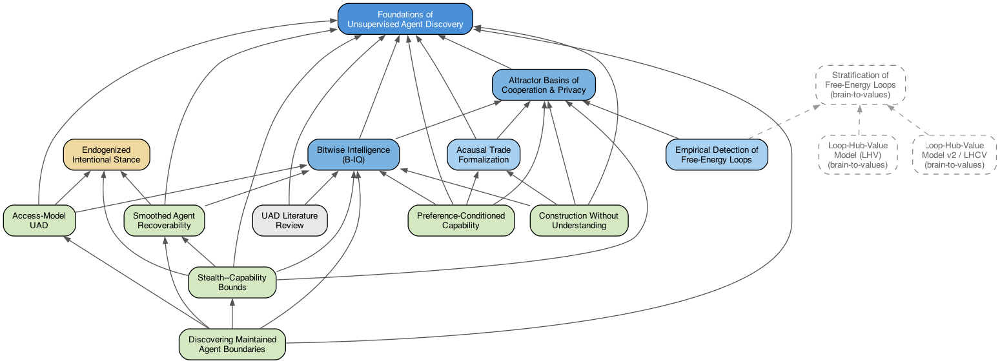

# Papers

LaTeX sources and built PDFs for each paper. Rebuild with the corresponding `build.sh` script.

| Paper | Source | PDF | Build |
|-------|--------|-----|-------|
| Handles Before Interventions: Access-Model UAD | [access-uad.tex](access-uad/access-uad.tex) | [PDF](access-uad/access-uad.pdf) | `access-uad/build.sh` — toy benchmark: [`uad_handles/README.md`](../../uad_handles/README.md) |
| Foundations of Unsupervised Agent Discovery | [unsupervised-agent-discovery.tex](unsupervised-agent-discovery/unsupervised-agent-discovery.tex) | [PDF](unsupervised-agent-discovery/unsupervised-agent-discovery.pdf) | `unsupervised-agent-discovery/build.sh` |
| Formalization of Acausal Trade atop UAD | [acausal_trade_uad_formalization.tex](acausal-trade-uad-formalization/acausal_trade_uad_formalization.tex) | [PDF](acausal-trade-uad-formalization/acausal_trade_uad_formalization.pdf) | `acausal-trade-uad-formalization/build.sh` |
| Attractor Basins of Cooperation, Privacy, and Parasite Persistence | [attractor-basins.tex](attractor-basins/attractor-basins.tex) | [PDF](attractor-basins/attractor-basins.pdf) | `attractor-basins/build.sh` |
| Empirical Detection of Free-Energy Loops and Attractor Basins | [applications_uad_loops.tex](applications-uad-loops/applications_uad_loops.tex) | — | `applications-uad-loops/build.sh` |
| Bitwise Intelligence | [bitwise_iq.tex](bitwise-iq/bitwise_iq.tex) | [PDF](bitwise-iq/bitwise_iq.pdf) | `bitwise-iq/build.sh` |
| Construction Without Understanding | [construction_without_understanding.tex](construction-without-understanding/construction_without_understanding.tex) | [PDF](construction-without-understanding/construction_without_understanding.pdf) | `construction-without-understanding/build.sh` |
| The Endogenized Intentional Stance | [endogenized-intentional-stance.tex](endogenized-intentional-stance/endogenized-intentional-stance.tex) | [PDF](endogenized-intentional-stance/endogenized-intentional-stance.pdf) | `endogenized-intentional-stance/build.sh` |
| Preference-Conditioned Capability | [preference-capability.tex](preference-capability/preference-capability.tex) | [PDF](preference-capability/preference-capability.pdf) | `preference-capability/build.sh` |
| Recoverability of Smoothed Agent Boundaries | [smooth-uad.tex](smooth-uad/smooth-uad.tex) | [PDF](smooth-uad/smooth-uad.pdf) | `smooth-uad/build.sh` |
| Discovering Maintained Agent Boundaries | [maintained-blanket.tex](maintained-blanket/maintained-blanket.tex) | [PDF](maintained-blanket/maintained-blanket.pdf) | `maintained-blanket/build.sh` |
| Stealth--Capability Bounds | [stealth-capability-bounds.tex](stealth-capability-bounds/stealth-capability-bounds.tex) | [PDF](stealth-capability-bounds/stealth-capability-bounds.pdf) | `stealth-capability-bounds/build.sh` |
| Prior and Related Work on UAD | [uad_literature_review.tex](uad-literature-review/uad_literature_review.tex) | [PDF](uad-literature-review/uad_literature_review.pdf) | `uad-literature-review/build.sh` |

Build from the repo root:

```bash
docs/papers/access-uad/build.sh
docs/papers/acausal-trade-uad-formalization/build.sh
docs/papers/applications-uad-loops/build.sh
docs/papers/attractor-basins/build.sh
docs/papers/bitwise-iq/build.sh
docs/papers/construction-without-understanding/build.sh
docs/papers/endogenized-intentional-stance/build.sh
docs/papers/preference-capability/build.sh
docs/papers/smooth-uad/build.sh
docs/papers/maintained-blanket/build.sh
docs/papers/stealth-capability-bounds/build.sh
docs/papers/uad-literature-review/build.sh
docs/papers/unsupervised-agent-discovery/build.sh
```

LaTeX build artifacts (`*.aux`, `*.log`, etc.) are gitignored. Paper PDFs are tracked in git; regenerate after source changes.

## Paper dependency graph

Arrows point from citing paper to cited paper. [DOT source](paper-dependencies.dot). Rebuild the figure with `dot -Tpng paper-dependencies.dot -o paper-dependencies.png`.



| Node | Paper | Role in the graph |
|------|-------|-------------------|
| UAD | Foundations of Unsupervised Agent Discovery | Core ε-blanket discovery |
| ABC | Attractor Basins | Persistence / cooperation / parasites atop UAD |
| BIQ | Bitwise Intelligence | Competence score (prediction, control, memory) |
| EIS | Endogenized Intentional Stance | Compression-based agency, not a UAD child |
| ACT | Acausal Trade Formalization | Decision theory on UAD + ABC |
| APP | Empirical Detection of Free-Energy Loops | Empirical ABC; dashed edges to the brain-to-values repo |
| ACC | Access-Model UAD | Handles / interventions; identifiability under access |
| SMU | Smoothed Agent Recoverability | Observation-channel recoverability of blankets |
| SCB | Stealth--Capability Bounds | Adversarial hiding vs BIQ under a filter family |
| MBU | Discovering Maintained Agent Boundaries | Viability/repair axis on UAD, distinct from B-IQ competence; observational rung before ACC handles; constrained by SMU and SCB |
| PCC | Preference-Conditioned Capability | Capability relative to inferred preferences |
| CWU | Construction Without Understanding | Construction vs reflective control |
| LIT | UAD Literature Review | Survey |
| FEL / LHV / LHV2 | brain-to-values papers | External (dashed) |
